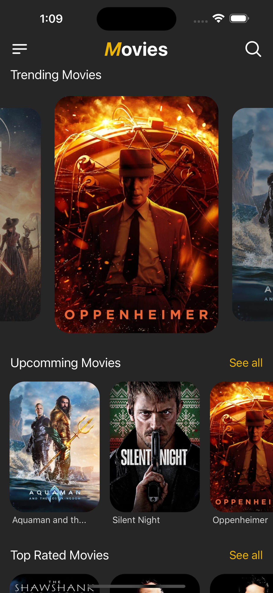
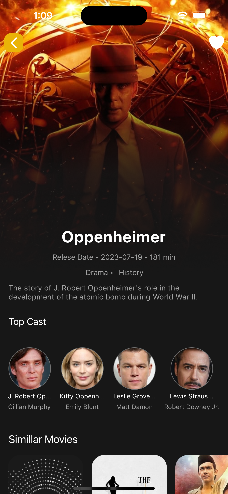
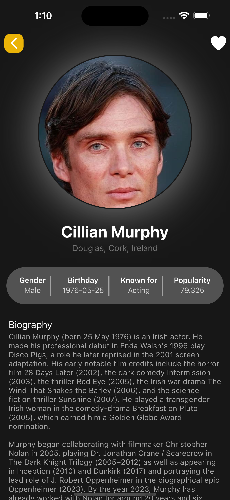
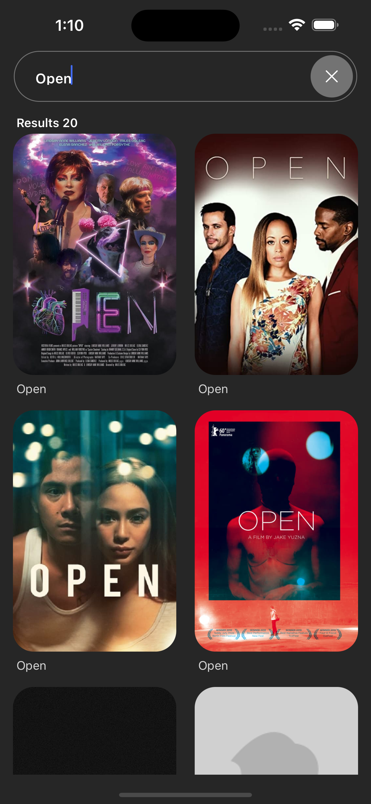

React Native Movies

Overview

React Native Movies is a mobile application built with React Native that allows users to browse and discover information about movies. It leverages The Movie Database (TMDb) API to fetch movie data and provides a user-friendly interface for users to explore details such as movie posters, cast information, and more.

Table of Contents

Installation
Screenshots
Features
Usage
Contributing
License
Screenshots

  
  
  
  

Installation

To run React Native Movies locally, follow these steps:

Clone the repository:
bash
Copy code
git clone https://github.com/bhupendrasambare/React-Native-Movies.git
Navigate to the project directory:
bash
Copy code
cd React-Native-Movies
Install dependencies:
bash
Copy code
npm install
Create a configuration file (config.js) in the root directory and add your TMDb API key:
javascript
Copy code
// config.js
const config = {
  apiKey: 'YOUR_TMDB_API_KEY',
};

module.exports = config;
Replace 'YOUR_TMDB_API_KEY' with your actual API key.
Start the application:
bash
Copy code
npx react-native run-android
or
bash
Copy code
npx react-native run-ios
Ensure you have the required development environment set up for either Android or iOS.
Usage

Open the React Native Movies app on your emulator or device.
Browse the home screen to discover popular movies.
Click on a movie to view detailed information, including the cast.
Explore cast details to see their filmography.
Features

Browse popular movies.
View detailed information about movies, including posters and cast.
Explore cast details and their filmography.
Responsive design for both Android and iOS.
Contributing

If you would like to contribute to React Native Movies, please follow these guidelines:

Fork the repository.
Create a new branch for your feature or bug fix: git checkout -b feature-name.
Make your changes and commit them: git commit -m "Description of changes".
Push your changes to the new branch: git push origin feature-name.
Open a pull request with a detailed description of your changes.
Please adhere to the existing coding style and conventions.

License

This project is licensed under the MIT License - see the LICENSE file for details.